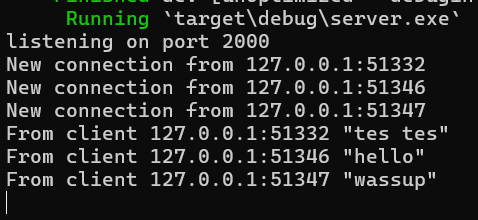

## 2.1. Original code of broadcast chat.

| Server | Client 1 | Client 2 | Client 3 |
| ------ | -------- | -------- | -------- |
|  |  |  |  |

Pada gambar diatas, saya menjalankan program dengan membuat sebuah server dan tiga client. Melalui percobaan broadcast diatas, dapat dilihat bahwa di saat suatu client mengirimkan pesan, maka server akan menerima pesan tersebut dan mengirimkannya kembali kepada semua client, termasuk client yang mengirim pesan.