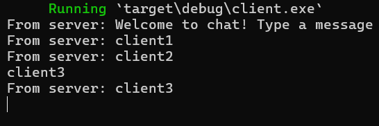

## 3.1. Original code of broadcast chat.

| Server | Client 1 | Client 2 | Client 3 |
| ------ | -------- | -------- | -------- |
|  |  |  |  |

Pada gambar di atas, saya menjalankan program dengan membuat sebuah server dan tiga client. Melalui percobaan broadcast di atas, dapat dilihat bahwa di saat suatu client mengirimkan pesan, maka server akan menerima pesan tersebut dan mengirimkannya kembali kepada semua client, termasuk client yang mengirim pesan.

# 2.2. Modifying the websocket port.
| Server | Client 1 | Client 2 | Client 3 |
| ------ | -------- | -------- | -------- |
|  |  |  |  |

Client akan mengalami error seperti gambar di atas apabila hanya server yang diubah portnya. Hal ini disebabkan karena port antara server dan client berbeda. Oleh karena itu kita perlu menyeleraskan port yang diakses oleh client dengan port server.

Client berhasil mengakses server dan mengirimkan pesan ke server jika memiliki port yang sama. Kode pada client.rs yang perlu diubah adalah:
```rust
let (mut ws_stream, _) =
        ClientBuilder::from_uri(Uri::from_static("ws://127.0.0.1:2000"))
            .connect()
            .await?;
```
menjadi
```rust
let (mut ws_stream, _) =
        ClientBuilder::from_uri(Uri::from_static("ws://127.0.0.1:8080"))
            .connect()
            .await?;
```
Selanjutnya,
```rust
 let listener = TcpListener::bind("127.0.0.1:2000").await?;
    println!("listening on port 2000");
```
perlu diganti menjadi
```rust
 let listener = TcpListener::bind("127.0.0.1:8080").await?;
    println!("listening on port 8080");
```
Berikut adalah hasil dari penjalanan program tersebut.
| Server | Client 1 | Client 2 | Client 3 |
| ------ | -------- | -------- | -------- |
|  |  |  |  |

Kedua program baik client maupun server memiliki protokol yang tetap sama seperti sebelumnya, yaitu menggunakan library `tokio_websockets` dan koneksi TCP.